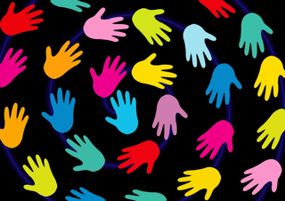
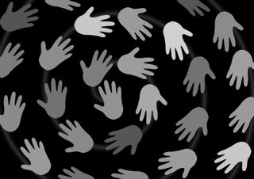
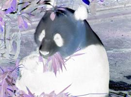

# ImageConversions
Convert Images into GrayScale or Negative

This project I made during the completion of Course (as a Honor Project) on Coursera.

* Converts all the colored Images of any Size into GrayScale.
* Converts all the colored Images of any Size into Negative.
* Save the Image with "gray-" or "inverted-" in the beginning of Image name.

# Converted Colored Image into GrayScale

# Converted Colored Image into Negative

